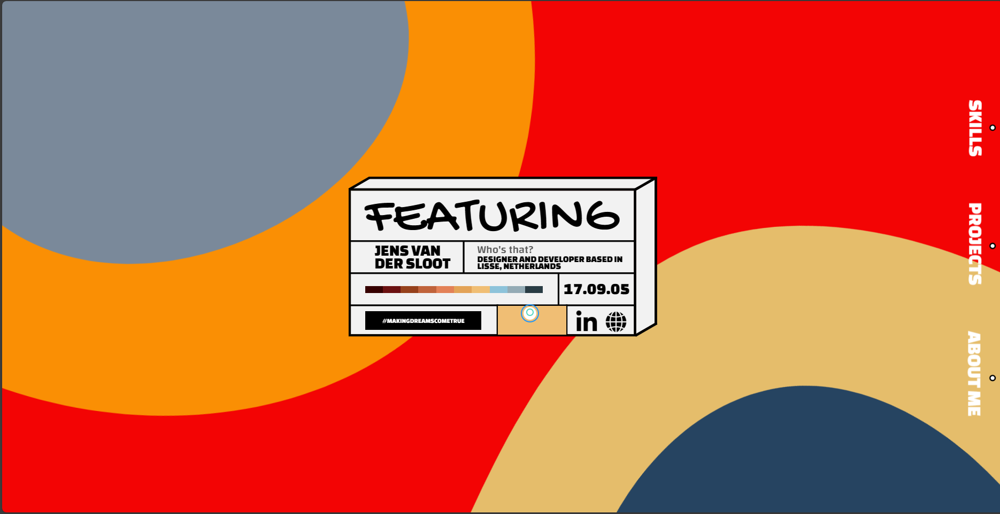

# Featuring, me 👋

I'm an 18-year-old  developer, currently pursuing a degree in Computer Science at Leiden University. 🎓

Even though my GitHub contributions might not be daily, rest assured, I’m making dreams come true every day. 🚀

I specialize in creating efficient user experiences on the web and I'm always open for collaboration on innovative projects. 💡

For further inquiries, check out my personal website noted below.

## Skills 🛠️

These are my most prominent abilities most of which I've worked with for over 3 years now. My newest prize is Spline, a 3d animation tool with amazingly efficient and really cool abilities.

## Portfolio Website 🌐

Happy exploring! 🎉

## Most recent project | Cursor Pursuit 🌐

